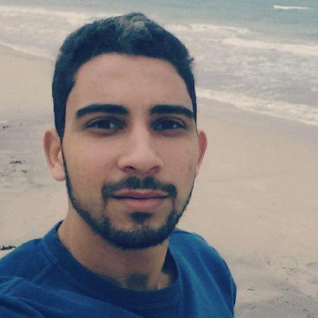

<BODY BACKGROUND="images/paper.jpg">
---
---

<link rel="stylesheet" href="styles.css" type="text/css">

I like to analyze data to answer research questions and test hypotheses. Currently I am interested in programming based on statistical softwares (Python, R, SAS, etc.) and all topics related to Machine Learning, Deep Learning, Data Mining and neural networks.

I am a terminal engineering student at the [Higher School of Statstics and Data Analysis(ESSAI), of Tunis](http://www.essai.rnu.tn/accueil.htm) to graduate as a Data Science engineer in June 2019. 

I did two professional engineering internships in two different companies in Tunisia based on Web Scrapping and digital analysis of Facebook and Twitter pages for different sectors. These internships helped me improving my skills in programming and understanding the work of social networks analysis algorithms.

I am actually a member of [AIESEC Medina's](https://aiesec.org/) IM/MKT department and support team member of AIESEC in Tunisia. I was the President of ESSAI Radio Club and the General Secretary of ESSAI Junior Enterprise where I concluded a project of market research and satisfaction. My last project was creating a mail system for AIESEC Tunisia and in progress of establishing an official website for this committee.

I am actually in search of Graduation Project for minimum 4 months.

<strong>My full CV is available [here](files/Aziz Abidi_CV_English.pdf).
</strong>

</BODY>